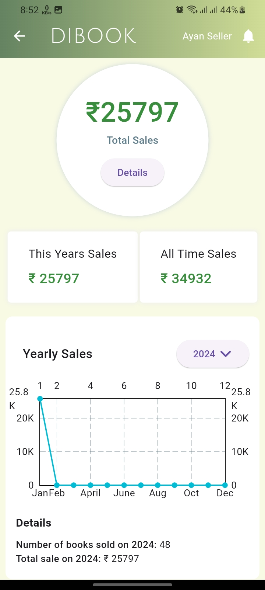

# Dibook - Online Book Reselling Platform

Dibook is an online reselling platform for books, allowing users to effortlessly buy and sell books. Whether you're looking for a new read or want to declutter your bookshelf, Dibook has got you covered.




## Features

- **Category-based Collection:** Easily explore books organized by categories.
- **Search Feature:** Find your favorite books quickly with our search functionality.
- **Book Details Page:** Dive into the specifics of each book to make informed decisions.
- **Questions Section:** Ask and answer questions related to each book.
- **Shopping Cart:** Conveniently manage your selected books in the cart.
- **Sell Your Books:** Have books to spare? List them for sale hassle-free.
- **Price Determination:** Set prices based on the condition of each book.
- **Downloadable Order Receipt:** Receive a PDF receipt for your orders.

## Prerequisites

The app depends on MongoDB for database, and Cloudinary for media files.
- Create a mongoDB account on [cloud.mongodb.com](cloud.mongodb.com)
- Create a project and cluster
- Create a cloudinary account.

## Getting Started

To run Dibook on your Android device, follow these steps:

1. **Clone the Repository:**
```
   git clone https://github.com/your-username/dibook.git
   cd dibook
   flutter pub get
```
2. **Set up .env file:**
- Navigate to the 'server' folder.
- Create a file named .env.
- Add the following content, replacing api_key and api_secret with your Cloudinary & Mongo DB API credentials:
```
    CLOUDINARY_API_KEY=api_key
    CLOUDINARY_API_SECRET=api_secret
    MONGO_USERNAME=your-mongo-username
    MONGO_PASSWORD=your-mongodb-password
    MONGO_CLUSTER=your-mongo-cluster
```

3. **Start the server locally**

     Inside the `server` folder, run this command:
```
    npm run dev
```

4. **Run the app**
 ```
    flutter run
 ```
5. **Explore Dibook:**
- Open the app on your Android phone.
- Browse, buy, sell, and enjoy the seamless book-reselling experience!

## Contributing
I would love your contributions! Feel free to submit pull requests.

## License
This project is licensed under the MIT License.

## Acknowledgments
Special thanks to the Flutter community and the developers of libraries/tools used in this project.
